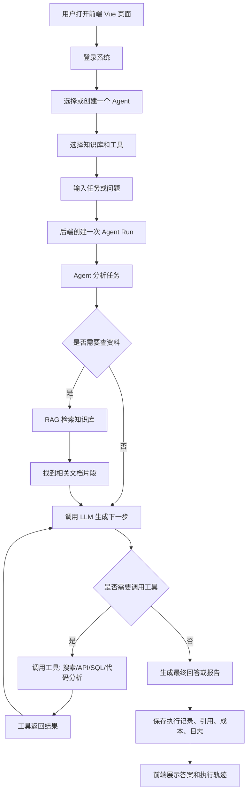
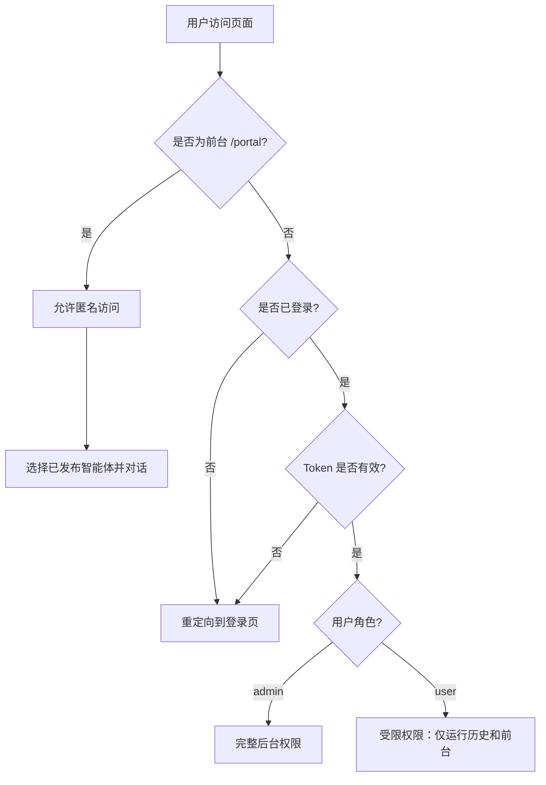
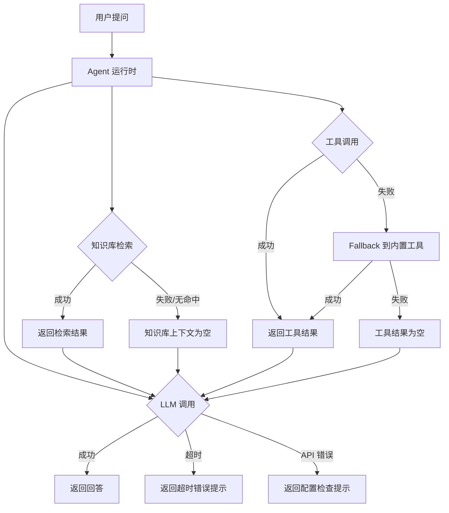
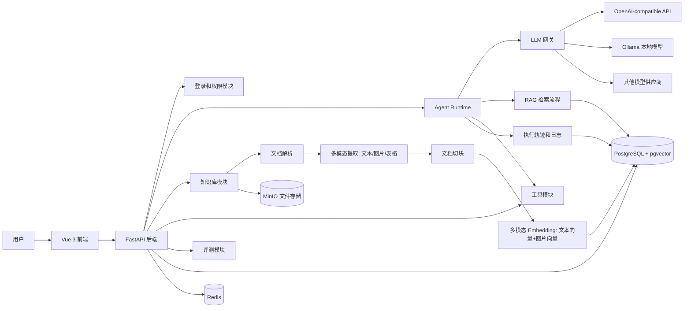
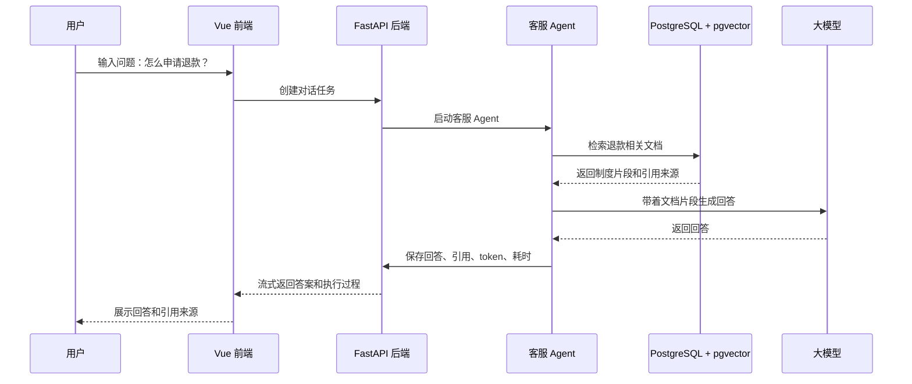

# Agent 项目流程图

## 1. 用户使用流程

## 2. 鉴权与权限流程

## 3. 错误处理流程

## 4. 系统架构流程

## 5. 一个实际例子：客服 Agent

## 6. 一句话理解

这个项目就是一个后台系统，用来创建和管理不同类型的 AI 助手。

用户不是直接写代码调用大模型，而是在页面里配置：

- 这个 Agent 是干什么的。
- 它能看哪些知识库。
- 它能调用哪些工具。
- 它完成任务时每一步怎么走。
- 它回答得好不好、花了多少钱、哪里失败了。

## 7. 核心技术关键词

- LLM：负责生成回答、推理、总结和工具选择。
- RAG：负责从知识库中检索资料，并把引用来源返回给用户。
- 切面：负责把鉴权、日志、审计、限流、追踪、成本统计这些能力统一挂到执行链路上。
- 向量：负责把文档和问题转成多模态 embedding（文本向量 + 图片向量），并用跨模态相似度检索找到相关内容。

## 8. 它为什么算大型项目

它算大型项目，因为它不是一个单功能 Demo，而是一个完整平台，至少包含这些系统：

1. 前端后台系统
   - 登录、布局、表格、表单、图表、工作流画布、聊天页面。

2. 后端 API 系统
   - 用户、权限、Agent、知识库、工具、任务、评测、日志。

3. 数据库系统
   - PostgreSQL 业务表、pgvector 向量检索、Redis 缓存、MinIO 文件存储。

4. LLM 工程系统
   - 多模型接入、流式输出、token 统计、失败重试、成本统计。

5. RAG 知识库系统
   - 文件上传、解析、多模态提取（文本/图片/表格）、切块、多模态 embedding、跨模态检索、引用来源。

6. Agent 执行系统
   - 任务编排、工具调用、执行步骤、长任务、失败恢复。

7. 可观测和评测系统
   - 执行轨迹、工具调用日志、模型效果对比、评测报告。

如果只做第一版 MVP，也至少会包含：

- Vue 前端
- FastAPI 后端
- PostgreSQL + pgvector
- Redis
- 文件上传
- RAG 问答
- Agent 执行记录
- Docker Compose 一键启动

所以它可以从小版本开始做，但整体方向确实是大型项目。
