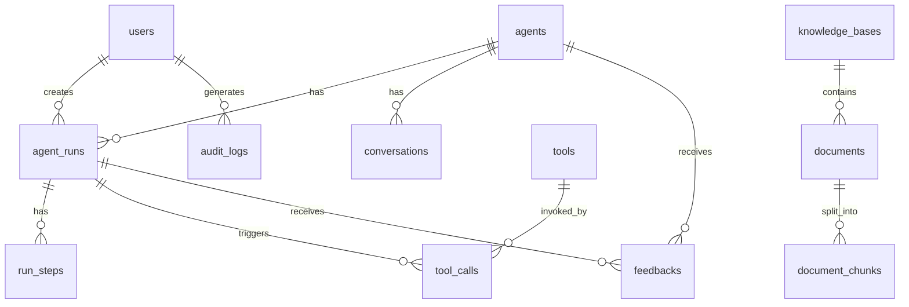

# 数据库设计

当前数据库使用 PostgreSQL + pgvector，共 21 张表。支持多模态 Embedding（文本 + 图片统一向量空间）。

## ER 关系图



## agents

智能体表。

字段：

- `id`：UUID 主键
- `name`：名称
- `description`：描述
- `system_prompt`：系统提示词
- `model`：模型名，可为空
- `status`：状态
- `config`：JSON 配置
- `created_at`
- `updated_at`

`config` 当前存储：

```json
{
  "model_config_id": "...",
  "knowledge_base_ids": ["..."],
  "tool_ids": ["current_time"]
}
```

## agent_runs

运行记录表。

字段：

- `id`：UUID 主键
- `agent_id`：智能体 ID
- `status`：运行状态
- `input`：用户输入
- `output`：模型输出
- `trace_id`：追踪 ID
- `usage`：JSON 使用信息
- `created_at`
- `updated_at`

## run_steps

运行步骤表。

字段：

- `id`：UUID 主键
- `run_id`：运行 ID
- `name`：步骤名
- `status`：步骤状态
- `detail`：JSON 详情
- `created_at`
- `updated_at`

## knowledge_bases

知识库表。

字段：

- `id`：UUID 主键
- `name`：名称
- `description`：描述
- `created_at`
- `updated_at`

## documents

文档表。

字段：

- `id`：UUID 主键
- `knowledge_base_id`：知识库 ID
- `filename`：文件名
- `status`：状态
- `created_at`
- `updated_at`

## document_chunks

文档切片表。支持多模态：文本块和图片块统一存储，通过 `content_type` 区分。

字段：

- `id`：UUID 主键
- `document_id`：文档 ID
- `content`：切片内容（文本块为文字内容，图片块为图片描述或占位文本）
- `content_type`：内容类型，`text`（文本块）或 `image`（图片块）
- `source`：来源文件
- `image_url`：图片存储路径（仅图片块有值，指向 MinIO 中的图片文件）
- `embedding`：多模态向量数据（文本和图片在同一向量空间，支持跨模态检索）
- `created_at`
- `updated_at`

多模态说明：

- 文本块：`content_type = "text"`，`content` 存储文本内容，`image_url` 为空，`embedding` 由文本 Embedding 模型生成。
- 图片块：`content_type = "image"`，`content` 存储图片描述（可选），`image_url` 指向 MinIO 中的图片文件，`embedding` 由多模态 Embedding 模型（如 CLIP）的图片编码器生成。
- 跨模态检索：文本查询和图片查询的向量在同一空间，可以直接用余弦相似度匹配。

## tools

工具表。

字段：

- `id`：UUID 主键
- `name`：名称（唯一）
- `type`：类型，当前支持 `http`
- `description`：描述
- `config`：JSON 配置（URL、Method、Headers、Query、Body、触发关键词、超时等）
- `enabled`：是否启用
- `created_at`
- `updated_at`

`config` 当前存储（HTTP 工具）：

```json
{
  "url": "http://host.docker.internal:8000/api/mock/order",
  "method": "GET",
  "trigger_keywords": ["订单", "物流"],
  "headers": {},
  "query": {},
  "body": {},
  "timeout_seconds": 20
}
```

## users

用户表。

字段：

- `id`：UUID 主键
- `username`：用户名（唯一）
- `password_hash`：bcrypt 密码哈希
- `role`：角色（默认 admin）
- `is_active`：是否激活（默认 True）
- `created_at`
- `updated_at`

## tool_calls

工具调用日志表。

字段：

- `id`：UUID 主键
- `run_id`：运行 ID（外键，关联 agent_runs）
- `tool_id`：工具 ID
- `tool_name`：工具名称
- `input`：调用输入
- `output`：调用输出
- `status`：调用状态
- `status_code`：HTTP 状态码
- `elapsed_ms`：耗时（毫秒）
- `error`：错误信息
- `detail`：JSON 详情
- `created_at`

## feedbacks

回答反馈表。记录用户对智能体回答的点赞/点踩。

字段：

- `id`：UUID 主键
- `run_id`：运行 ID（外键，关联 agent_runs，可为空）
- `agent_id`：智能体 ID（外键，关联 agents，可为空）
- `rating`：评价类型（`like` 或 `dislike`）
- `comment`：评论内容（默认空字符串）
- `created_at`
- `updated_at`

## conversations

对话记忆表。存储前台会话的完整消息列表和上下文压缩摘要。

字段：

- `id`：UUID 主键
- `agent_id`：智能体 ID（外键，关联 agents）
- `session_id`：前端生成的会话 ID（VARCHAR(80)）
- `title`：会话标题（默认空字符串）
- `messages`：完整消息列表（JSON，格式为 `[{role, content}]`）
- `summary`：上下文压缩摘要（默认空字符串）
- `summary_to_turn`：摘要覆盖到第几轮（默认 0）
- `created_at`
- `updated_at`

> 注意：上下文压缩摘要直接内嵌在 conversations 表中（`summary` + `summary_to_turn` 字段），而非独立的 `conversation_summaries` 表。

## model_configs

模型配置表。

字段：

- `id`：UUID 主键
- `name`：配置名（唯一）
- `base_url`：OpenAI-compatible Base URL
- `api_key`：API Key（已使用 Fernet/AES-256 加密存储，非明文）
- `default_model`：默认模型名
- `is_default`：是否默认
- `created_at`
- `updated_at`

## audit_logs

审计日志表，记录用户管理操作。

| 字段 | 类型 | 说明 |
|------|------|------|
| id | UUID | 主键 |
| timestamp | DateTime | 操作时间 |
| user_id | String(36) | 操作者 ID |
| username | String(80) | 操作者用户名 |
| action | String(50) | 操作类型（create_user / update_user / delete_user） |
| resource | String(100) | 操作目标（如 user/{id}） |
| detail | Text | 操作详情 |
| ip_address | String(45) | 操作者 IP |

## 计划新增的表

| 表名 | 说明 | 状态 |
|------|------|------|
| `api_keys` | API Key 管理（key、权限、过期时间） | 规划中 |
| `agent_versions` | Agent 版本管理（agent_id、version、snapshot、published） | 规划中 |

## eval_datasets

评测数据集表。

| 字段 | 类型 | 说明 |
|------|------|------|
| id | UUID | 主键 |
| name | String(100) | 数据集名称 |
| description | Text | 数据集描述 |
| cases | JSON | 测试用例列表 |
| created_at | DateTime | 创建时间 |
| updated_at | DateTime | 更新时间 |

## eval_results

评测结果表。

| 字段 | 类型 | 说明 |
|------|------|------|
| id | UUID | 主键 |
| dataset_id | UUID | 关联数据集 |
| agent_id | UUID | 关联智能体 |
| results | JSON | 评测结果详情 |
| summary | JSON | 评测摘要（准确率、耗时等） |
| created_at | DateTime | 创建时间 |

## v3.0 新增表定义

v3.0 版本新增以下数据表，覆盖会话管理、反馈、评测、工作流及 RAG 调优等功能。

### conversations

对话会话表，存储前台会话的完整消息历史和摘要。

| 字段 | 类型 | 说明 |
|------|------|------|
| id | UUID PK | 主键 |
| session_id | String(64) | 会话标识 |
| messages | JSON | 消息历史 |
| summary | Text | 会话摘要 |
| created_at | DateTime | 创建时间 |
| updated_at | DateTime | 更新时间 |

### feedback

回答反馈表，记录用户对智能体回答的点赞/点踩。

| 字段 | 类型 | 说明 |
|------|------|------|
| id | UUID PK | 主键 |
| run_id | UUID FK | 关联运行记录 |
| agent_id | UUID FK | 关联智能体 |
| rating | String(10) | like / dislike |
| comment | Text | 反馈评论 |
| created_at | DateTime | 创建时间 |
| updated_at | DateTime | 更新时间 |

### eval_datasets

评测数据集表，定义智能体评测用例集合。

| 字段 | 类型 | 说明 |
|------|------|------|
| id | UUID PK | 主键 |
| name | String(120) | 数据集名称 |
| description | Text | 描述 |
| agent_id | UUID FK | 关联智能体 |
| cases | JSON | 测试用例 [{question, expected_keywords}] |
| created_at | DateTime | 创建时间 |
| updated_at | DateTime | 更新时间 |

### eval_results

评测结果表，记录每次评测执行的详细结果。

| 字段 | 类型 | 说明 |
|------|------|------|
| id | UUID PK | 主键 |
| dataset_id | UUID FK | 关联数据集 |
| agent_id | UUID FK | 关联智能体 |
| status | String(30) | running/completed/failed |
| total_cases | Integer | 总用例数 |
| passed_cases | Integer | 通过数 |
| accuracy | Float | 准确率 |
| avg_duration_ms | Integer | 平均耗时 |
| details | JSON | 详细结果 |
| created_at | DateTime | 创建时间 |
| updated_at | DateTime | 更新时间 |

### workflows

工作流定义表，存储可视化工作流的节点和连线配置。

| 字段 | 类型 | 说明 |
|------|------|------|
| id | UUID PK | 主键 |
| name | String(120) | 工作流名称 |
| description | Text | 描述 |
| nodes | JSON | 节点列表 [{id, type, label, config}] |
| edges | JSON | 连线列表 [{source, target}] |
| status | String(30) | draft/published |
| created_at | DateTime | 创建时间 |
| updated_at | DateTime | 更新时间 |

### workflow_runs

工作流执行记录表，记录每次工作流运行的输入输出及各节点结果。

| 字段 | 类型 | 说明 |
|------|------|------|
| id | UUID PK | 主键 |
| workflow_id | UUID FK | 关联工作流 |
| status | String(30) | running/completed/failed |
| input | Text | 用户输入 |
| output | Text | 最终输出 |
| node_results | JSON | 节点执行结果 |
| duration_ms | Integer | 总耗时 |
| error | Text | 错误信息 |
| created_at | DateTime | 创建时间 |
| updated_at | DateTime | 更新时间 |

### rag_configs

RAG 检索调优配置表，按知识库存储检索参数。

| 字段 | 类型 | 说明 |
|------|------|------|
| id | UUID PK | 主键 |
| knowledge_base_id | UUID FK UNIQUE | 关联知识库 |
| chunk_size | Integer | 切块大小（默认 500） |
| chunk_overlap | Integer | 切块重叠（默认 50） |
| top_k | Integer | 检索数量（默认 5） |
| score_threshold | Float | 相似度阈值（默认 0.3） |
| retrieval_weight_vector | Float | 向量权重（默认 0.7） |
| retrieval_weight_lexical | Float | 关键词权重（默认 0.3） |
| created_at | DateTime | 创建时间 |
| updated_at | DateTime | 更新时间 |

## 数据库索引

| 表 | 索引字段 | 类型 | 说明 |
|----|----------|------|------|
| agent_runs | agent_id | B-tree | 按智能体查询运行记录 |
| agent_runs | created_at | B-tree | 按时间排序运行记录 |
| agent_runs | status | B-tree | 按状态筛选运行记录 |
| document_chunks | document_id | B-tree | 按文档查询切片 |
| document_chunks | embedding | IVFFlat (pgvector) | 向量相似度检索 |
| conversations | agent_id | B-tree | 按智能体查询对话 |
| conversations | session_id | B-tree | 按会话 ID 查询对话 |
| tool_calls | run_id | B-tree | 按运行记录查询工具调用 |
| feedbacks | run_id | B-tree | 按运行记录查询反馈 |
| feedbacks | agent_id | B-tree | 按智能体查询反馈 |
| eval_results | dataset_id | B-tree | 按数据集查询评测结果 |
| eval_results | agent_id | B-tree | 按智能体查询评测结果 |

## 安全备注

| 字段 | 风险 | 建议 |
|------|------|------|
| `model_configs.api_key` | 已使用 Fernet/AES-256 加密存储 | 安全，确保 `ENCRYPTION_KEY` 环境变量已设置 |
| `users.password_hash` | 已使用 bcrypt 哈希 | 安全，建议 cost factor ≥ 12 |
| `tools.config` 中 Headers | 可能包含 Bearer Token 等敏感信息 | 脱敏显示，加密存储 |
